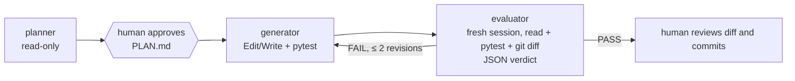

# Lab 13 — Capstone: planner → generator → evaluator

**Start from:** `app/` at tag `lab12-done`, with the Lab 0 setup loaded
(see [Working in `app/`](../README.md#working-in-app)).

**Goal:** combine everything: separate roles with separate tool
envelopes, a human approval gate, a machine-checked verdict and a bounded
revision loop. Read [`pge.ps1`](pge.ps1) (or [`pge.sh`](pge.sh)):



The evaluator is a **fresh session**. It doesn't see the generator's
reasoning, only the plan, the code and the test results. That
independence is the point.

## 1. Run it on a feature branch

```powershell
git switch -c feature/receipt
..\lab13-capstone\pge.ps1 -Feature "Add a 'receipt' CLI command: python cli.py receipt P1:2 P3:1 --code SAVE10 prints an itemized receipt with line totals, discount, tax and grand total, all from integer cents. Include tests."
```

```sh
git switch -c feature/receipt
bash ../lab13-capstone/pge.sh "Add a 'receipt' CLI command: python cli.py receipt P1:2 P3:1 --code SAVE10 prints an itemized receipt with line totals, discount, tax and grand total, all from integer cents. Include tests."
```

(Adjust the flags if your Lab 4 discount design differs.) When the script
pauses, **read `PLAN.md`**. Edit it if you disagree; the generator
follows the file. Then press Enter.

## 2. Observe the roles

- Planner: which files did it read? Did it touch anything? (It can't.)
- Generator: turns, files changed, hook events.
- Evaluator: its JSON verdict and reasons. If it said FAIL, did the
  revision fix exactly what it flagged?
- Every node's events are in `.runs/pge-*.jsonl`.

## 3. Review and finish as the human

```powershell
git diff --stat main
python -m pytest -q
```

Nothing is committed automatically. If you agree with the verdict, commit
(Conventional Commit message), merge into `main`, and maybe run
`/release-notes` from Lab 8.

## Record

| Node | Turns | Cost | Tools used | Output |
|---|---|---|---|---|

Plus: did the evaluator catch anything you would have missed? Did it
pass something you'd reject?

## Checkpoint

```powershell
git switch main ; git merge --no-ff feature/receipt
git tag lab13-done
```
