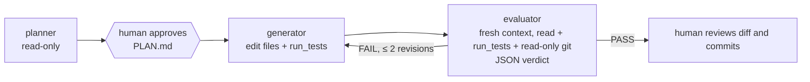

# Lab 13 — Capstone: planner → generator → evaluator

Combine everything: separate roles with separate tool lists, a human
approval gate, a machine-checked verdict and a bounded revision loop.
This standalone snapshot adds `harness pge "feature"`:



The evaluator starts from an **empty history**. It doesn't see the
generator's reasoning, only the plan, the code and the test results.
That independence is the point.

The exercise matches the
[Claude Code Lab 13](../../existing-harnesses/claude-code/lab13-capstone/).

## What changes

- [`harness/pge.py`](harness/pge.py) runs the graph in plain code:
  - **planner**: `list_files`, `read_file`, `git_status`, `git_log`. The
    harness writes its answer to `PLAN.md`.
  - **human gate**: the CLI stops until you confirm. Edit `PLAN.md` first
    if you disagree; the generator reads the file.
  - **generator**: `list_files`, `read_file`, `write_file`, `edit_file`,
    `run_tests`, with edits accepted.
  - **evaluator**: `list_files`, `read_file`, `run_tests`, `git_status`
    and `git_cli` (read-only git only: anything else would ask, and asks
    are denied). It must reply with a JSON verdict; anything else counts
    as FAIL.
  - On FAIL, the generator gets the failed criteria and feedback, at most
    `--max-revisions` times (default 2).
- Each role is an agent (Lab 9) behind the project's hooks and
  permissions; nobody is asked to approve a call during the run. Nothing
  is committed.
- One trace per run in `.runs/pge-<time>.jsonl`, with a `node` event per
  role and a `verdict` event per evaluation.
- `--no-evaluator` is an ablation: one generator pass, no independent
  check, so you can compare.

[`harness/capstone.py`](harness/capstone.py) keeps the earlier in-process
model of a planner-generator-evaluator graph with ablation metadata.

## Learner steps

**Start from:** `labs/app/` at tag `lab12-done` (see the
[track guide](../README.md#working-in-labsapp)).

1. Install this lab and configure Foundry as before:

   ```bash
   python -m venv .venv
   . .venv/bin/activate          # Windows: .\.venv\Scripts\Activate.ps1
   pip install -e '.[dev]'
   cp .env.example .env
   az login
   cd ../app
   ```

   Read [`harness/pge.py`](harness/pge.py) first.

2. Run it on a feature branch:

   ```bash
   git switch -c feature/receipt
   harness pge "Add a 'receipt' CLI command: python cli.py receipt P1:2 P3:1 --code SAVE10 prints an itemized receipt with line totals, discount, tax and grand total, all from integer cents. Include tests."
   ```

   (Adjust the flags if your Lab 4 discount design differs.) When it
   pauses, **read `PLAN.md`**. Edit it if you disagree, then answer `y`.

3. Observe the roles:
   - Planner: which files did it read? Did it touch anything? (It can't.)
   - Generator: LLM calls, files changed, hook feedback.
   - Evaluator: its verdict and failed criteria. If it said FAIL, did the
     revision fix exactly what it flagged?
   - The whole run is in `.runs/pge-<time>.jsonl`; summarize it with
     `harness trace`.

4. Review and finish as the human:

   ```bash
   git diff --stat main
   python -m pytest -q
   ```

   Nothing is committed automatically. If you agree with the verdict,
   commit (Conventional Commit message), merge into `main`, and maybe run
   `/release-notes` from Lab 8.

5. Optional ablation: on a throwaway branch from `main`, run the same
   feature with `--no-evaluator` and compare the result with the evaluated
   run.

6. **Record**

   | Node | LLM calls | Tool calls | Denied | Output |
   |---|---|---|---|---|

   Plus: did the evaluator catch anything you would have missed? Did it
   pass something you'd reject?

7. **Checkpoint.** In `app/`:

   ```bash
   git switch main && git merge --no-ff feature/receipt
   git tag lab13-done
   ```

8. Back in the lab folder, run the offline checks and inspect the declared
   capabilities:

   ```bash
   pytest checks/
   harness lab-info
   ```

`harness ask` keeps stop hooks (Lab 11), compaction (Lab 10), subagents and
background agents (Lab 9), skills and MCP (Lab 8), tracing (Lab 7),
permissions (Lab 6), file memory (Lab 5), plan mode and todos (Lab 4),
sessions (Lab 3) and the Lab 2B tools, built-in policy, project hooks and
rules; `harness route` (Lab 12) is still available. This is a teaching
harness, not a sandbox: only use it on the practice app.
